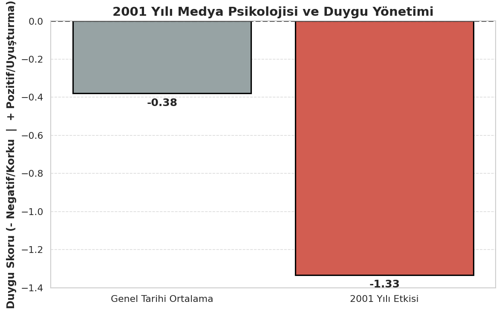

# 📰 Medya, Reklam Dini ve Hakikat Savaşı (1950-2026) - NLP Analizi


Bu proje, 1950'den günümüze kadar medya ve reklam endüstrisinin kitleleri nasıl yönlendirdiğini, korku ve tüketim kültürünü nasıl inşa ettiğini **Doğal Dil İşleme (NLP)** ve **Makine Öğrenmesi** algoritmaları kullanarak analiz eden akademik bir veri bilimi çalışmasıdır.

Sosyolog ve yazar Savaş Şafak Barkçin'in **"Reklam Dini"** konseptinden ilham alınarak hazırlanmıştır.

## 📌 Projenin Amacı
Projenin temel amacı; tarihsel süreçteki küresel olayların (Soğuk Savaş, Vietnam, 11 Eylül, Gazze vb.) medya tarafından halka nasıl sunulduğunu, devletlerin ve çok uluslu şirketlerin (aktörlerin) hangi kavramları kullanarak toplum mühendisliği yaptığını matematiksel olarak ispatlamaktır.

## 🚀 Özellikler (Features)
- **Tarihsel Veri Seti (1950-2026):** Her on yıla ve döneme özel medya söylemleri, aktörler ve propagandalar.
- **Duygu Analizi (Sentiment Analysis):** Sistem, dönemin medyasının "Korku/Tahakküm" mü yoksa "Suni Mutluluk/Uyuşturma" mı pompaladığını matematiksel olarak puanlar.
- **Makine Öğrenmesi (TF-IDF):** Sistemin zihnimizi kodlamak için en sık kullandığı anahtar kelimelerin (kavramların) ağırlık analizi.
- **İnteraktif Arayüz:** Google Colab / Jupyter Notebook üzerinde çalışan, grafikleri ve akademik analizleri anlık olarak ekrana basan dinamik konsol tasarımı.

## 📊 Veri Görselleştirme ve Analiz
Proje sonucunda yapay zeka, seçilen yıla veya kavrama göre akademik kalitede grafikler (`Seaborn` & `Matplotlib`) üretmektedir. 

> **Not:** Aşağıdaki grafik, NLP modelimizin analiz çıktılarından bir örnektir.

*(Buraya projenin örnek ekran görüntüsünü ekledim. GitHub'a yüklerken görselin adını buna göre ayarlayabilirsiniz.)*



## 🛠️ Kullanılan Teknolojiler
Bu projede veri manipülasyonu, makine öğrenmesi ve veri görselleştirme için aşağıdaki modern Python kütüphaneleri kullanılmıştır:
* `Pandas` & `NumPy` (Veri İşleme)
* `Scikit-Learn` (TF-IDF Vektörizasyonu)
* `Seaborn` & `Matplotlib` (Veri Görselleştirme)

## 💻 Kurulum ve Kullanım
Bu projeyi kendi bilgisayarınızda veya Google Colab üzerinde çalıştırmak oldukça basittir.

1. Projeyi bilgisayarınıza klonlayın:
   ```bash
   git clone [https://github.com/Salihfrt/Makine-Ogrenmesi-Projesi.git](https://github.com/Salihfrt/Makine-Ogrenmesi-Projesi.git)